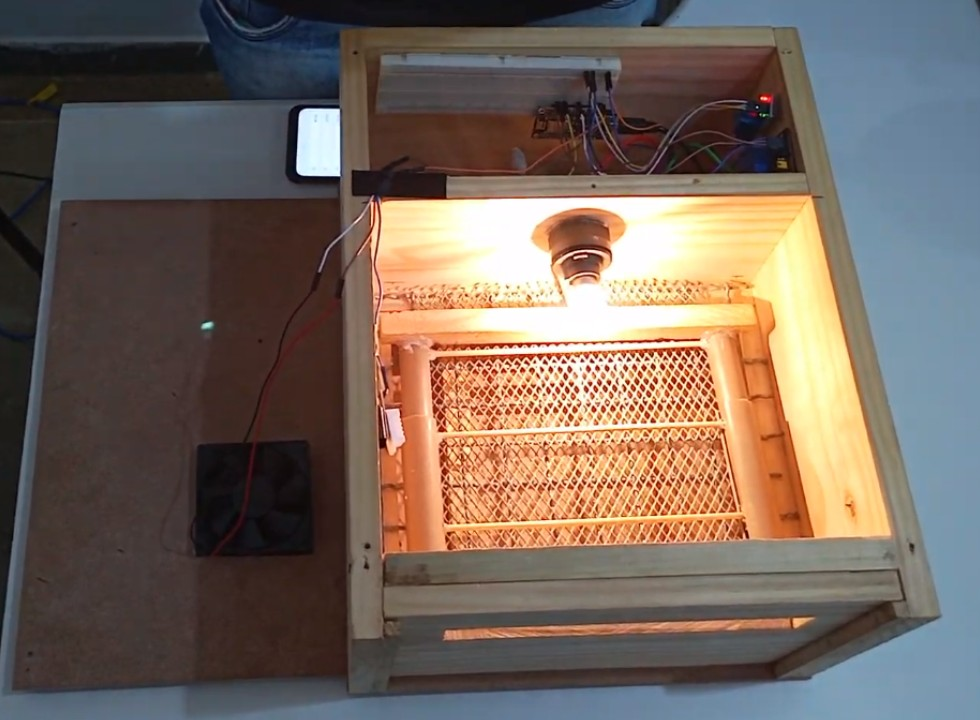
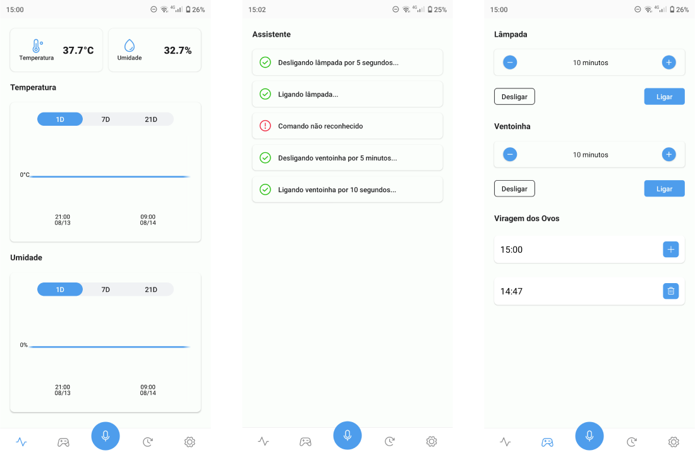

# Chocadeira IoT

É um projeto que combina automação com microcontroladores para chocagem de ovos de forma automática e a tecnologia de Internet das Coisas (IoT) para monitoramento da ferramenta. A ideia do projeto surgiu para um trabalho da matéria de Projeto Integrador durante o meu curso técnico, o projeto foi apresentado em dois eventos organizados pela minha instituição, um deles aberto ao público no qual muitos produtores ficaram interessados em adquirir a chocadeira e buscavam saber sobre o futuro do projeto.

[Veja um vídeo da explicação do projeto.](https://photos.app.goo.gl/2SVVkY2Wyj5XuFg18)

    

    

### Recursos em Destaque

- **Automação Inteligente:** Sistema preciso de chocagem de ovos, controlando fatores como temperatura, umidade e rolagem dos ovos para criar o ambiente ideal para incubação.
- **Controle e Monitoramento Remoto:** Por meio de um aplicativo você consegue monitorar o funcionamento, além de definir os horários para a rolagem dos ovos.
- **Comandos por voz:** Através do aplicativo você pode enviar comandos por voz para ligar ou desligar a lâmpada, ligar ou desligar a ventoinha por determinado período de tempo.
- **Análise de Dados:** A coleta contínua de dados permite análises detalhadas sobre o processo de chocagem ao longo do tempo, fornecendo insights valiosos para otimizar futuros ciclos de incubação.

### Estrutura do Repositório

- **app/** &nbsp;**-**&nbsp; Contém o código-fonte do aplicativo IoT que permite o monitoramento e controle da chocadeira remotamente, desenvolvido com **React Native**.
- **esp8266/** &nbsp;**-**&nbsp; Aqui você encontra código para o microcontrolador esp8266 responsável por fazer todo o gerenciamento da chocadeira.

### Equipamentos e sensores

- **ESP8266:** Microcontrolador com capacidade de comunicação por WiFi.
- **DHT22:** Sensor de temperatura e umidade digital.
- **Relé:** 3 interruptores eletromecânicos para acionamento dos items abaixo.
- **Lâmpada incandescente:** Aquecimento dos ovos.
- **Ventoinha:** Controle da umidade.
- **Motor de micro-ondas:** Rolagem dos ovos.
